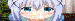

# bash AA

generate bash colorized block from jpeg image.

**Caution! Bash color palette makes bad color exportion!**

## Usage

```bash
 $ npm install
 $ node start /path/to/file.jpg
 $ bash dest/output.sh
```

move generated output.sh to Home directory and in .bashrc

```
[.bashrc]
bash ~/output.sh
```

will show color blocks when you login.

## Before



* Optimized by [gimp palette](gimp-palette.gpl).
* As terminal line-height is double of line-width, so the image's is half height.

## After


# Bash AA 日本語版

jpeg画像から bash カラーブロックを生成します。

**注意! bash カラーパレットはひどい色になります!**

## 利用方法

```bash
 $ npm install
 $ node start /path/to/file.jpg
 $ bash dest/output.sh
```

生成された output.sh をホームディレクトリに移動し、 .bashrc で

```
[.bashrc]
bash ~/output.sh
```

とすることでログイン時にカラーブロックが表示されます。
